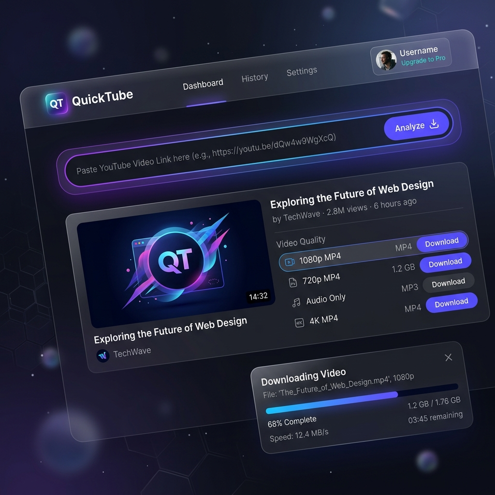

# 🚀 QuickTube - High-Performance YouTube Downloader

[](https://fastapi.tiangolo.com/)
[](https://reactjs.org/)
[](https://vitejs.dev/)
[](https://tailwindcss.com/)

QuickTube is a modern, sleek, and high-performance YouTube video downloader. Built with a robust **FastAPI** backend and a premium **React** frontend, it offers a seamless experience for fetching metadata and downloading videos in multiple formats (MP4/MP3) with real-time progress tracking.



## ✨ Features

- 🔍 **Instant Metadata Fetching**: Get video titles, thumbnails, and duration instantly.
- 📥 **Multiple Formats**: Download as high-quality MP4 or extract audio as MP3.
- 📊 **Real-time Progress**: Smooth progress bars with speed and ETA tracking via Server-Sent Events (SSE).
- 🎨 **Premium UI/UX**: Stunning glassmorphism design with dark mode and smooth animations (Framer Motion).
- 🧹 **Auto-Cleanup**: Backend automatically cleans up downloaded files after serving them to save disk space.

## 🛠️ Tech Stack

### Backend
- **FastAPI**: Modern, fast web framework for building APIs.
- **yt-dlp**: Powerful command-line program to download videos.
- **FFmpeg**: Multimedia framework for handling audio/video merging and conversion.
- **Uvicorn**: Lightning-fast ASGI server.

### Frontend
- **React 19**: The latest React features for a responsive UI.
- **Vite**: Ultra-fast frontend build tool.
- **Tailwind CSS 4**: Utility-first CSS for premium styling.
- **Framer Motion**: Smooth, high-quality animations.
- **Lucide React**: Beautiful, consistent iconography.

## 🚀 Getting Started

### Prerequisites
- **Python 3.10+**
- **Node.js 18+**
- **FFmpeg**: Must be installed and added to your system's PATH.

### Installation

1. **Clone the repository**
   ```bash
   git clone https://github.com/abhipatel0000/Youtube_Video_Downloader.git
   cd Youtube_Video_Downloader
   ```

2. **Setup Backend**
   ```bash
   cd backend
   python -m venv venv
   source venv/bin/activate  # On Windows: venv\Scripts\activate
   pip install -r requirements.txt
   ```

3. **Setup Frontend**
   ```bash
   cd ../frontend
   npm install
   ```

### Running the Application

1. **Start Backend API**
   ```bash
   cd backend
   uvicorn main:app --reload --port 8000
   ```

2. **Start Frontend Dev Server**
   ```bash
   cd frontend
   npm run dev
   ```

3. Open your browser and navigate to `http://localhost:5173` (or the port shown in your terminal).

## 📖 Usage

1. Paste a YouTube URL into the search bar.
2. Click **Fetch Details** to see video information.
3. Select your desired format (e.g., MP4 1080p or MP3).
4. Click **Download** and watch the real-time progress bar.
5. Once complete, your file will automatically download to your computer.

## 📝 License

This project is licensed under the MIT License.

---
Built with ❤️ by [Abhi Patel](https://github.com/abhipatel0000)
